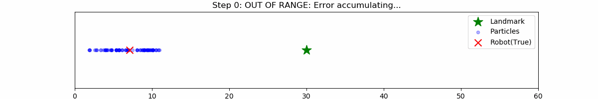

# モンテカルロ位置推定(MCL)の実装
1次元空間におけるロボットの自己位置推定を, MCLを用いて実装したものです.

## 実行結果

### 各ステップの挙動
*   **初期状態**: 自身の位置が不明であるため,パーティクルを0mから20mに一様に分布します.
*   **移動更新**: ランドマークが観測できない間は, 移動ノイズの累積によってパーティクルの分布が拡大し続けます.
*   **計測更新と収束**: 15m地点にあるランドマークに近づき, 計測を行うと, 尤度計算とリサンプリングを通じてパーティクルが収束します.

## アルゴリズムの説明

### 1. 移動更新
状態遷移モデル $p(x_t | x_{t-1}, u_t)$ に基づき、各パーティクルを移動させます.
*   制御指令: $u_t = 0.5$

### 2. 計測更新
特定の座標（15.0m）に設置された点ランドマークを観測します.
*   尤度関数: $L(x_t) = p(z_t | x_t)$ 
実際の観測値 $z$ とパーティクルから予測される観測値の誤差から、ガウス分布を用いて各パーティクルの重みを算出します.

### 3. リサンプリング
重みに基づいてパーティクルをコピーします.これにより、尤度の低いパーティクルが排除され, もっともらしい位置に分布が収束します.

## 環境
*   WSL (Ubuntu 20.04)
*   Python 3.8.10

## 参考文献
*  上田隆一『詳解 確率ロボティクス -Pythonによる基礎アルゴリズムの実装-』
## ライセンス
